# 20 Best Web Hosting Platforms in 2025

Finding the right web host can feel like navigating a maze blindfolded. You're looking for that perfect blend of speed, reliability, and support without breaking the bank. This guide cuts through the noise, offering a clear look at the top web hosting platforms of 2025, ensuring your website has a stable and speedy foundation.

## **[Ultahost](https://ultahost.com)**

Ultahost is a versatile hosting provider offering a wide spectrum of solutions, from affordable shared hosting to powerful dedicated servers, focusing on performance and security.

It’s built for users who anticipate growth. You can start with a basic plan and scale up seamlessly as your traffic increases. Ultahost provides a range of services, including Shared, WordPress, VPS, and Dedicated Server hosting, along with specialized options like macOS and game servers.

**Key Features:**
* **Performance:** Utilizes fast NVMe SSD storage and LiteSpeed servers to boost loading speeds.
* **Global Reach:** Operates data centers across 12+ locations on six continents, minimizing latency for global audiences.
* **Security:** Comes packed with security features like free SSL certificates, daily backups, BitNinja protection, and robust DDoS mitigation.
* **Uptime:** Promises a 99.9% uptime guarantee, ensuring your site remains accessible.
* **User Experience:** Features a modern, organized dashboard and offers a choice of control panels to manage your server environment easily.

## **[Hostinger](https://www.hostinger.com)**

Hostinger is widely regarded as one of the best overall values in web hosting, making it an excellent choice for beginners and those on a tight budget.

It delivers a user-friendly experience without sacrificing performance. The plans are packed with features, including free weekly or daily backups, free SSL certificates, and a free domain for the first year on annual plans. With its proprietary hPanel, managing your site is intuitive. Hostinger offers a range of services including shared, cloud, and VPS hosting, making it scalable for growing websites.

## **[Liquid Web](https://www.liquidweb.com)**

Liquid Web is a premium hosting provider specializing in high-performance managed VPS and dedicated server hosting, tailored for agencies, developers, and businesses where downtime is not an option.

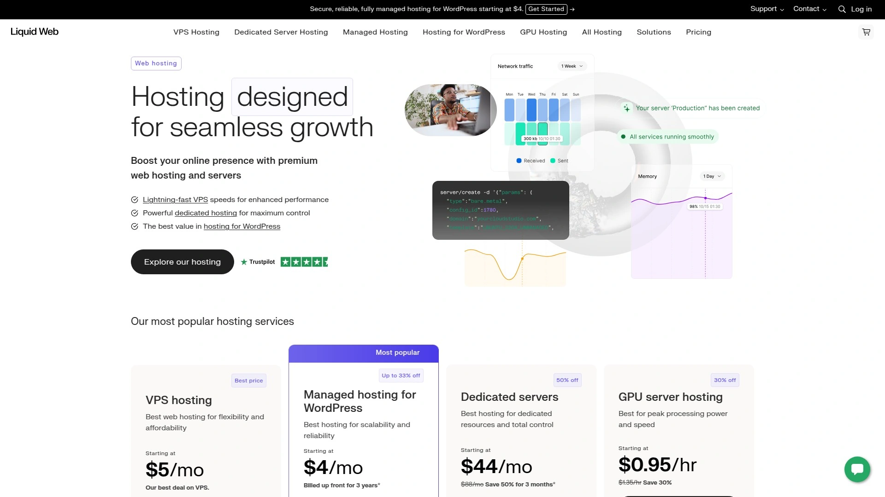

They are known for their "Heroic Support," available 24/7/365. Liquid Web offers a 100% network uptime Service Level Agreement (SLA), a testament to their reliability. You get a choice of cPanel, Plesk, or InterWorx control panels and options for both managed and self-managed servers, providing flexibility for different technical needs.

## **[SiteGround](https://www.siteground.com)**

SiteGround is a favorite among small businesses and WordPress users, known for its reliable infrastructure and excellent customer support.

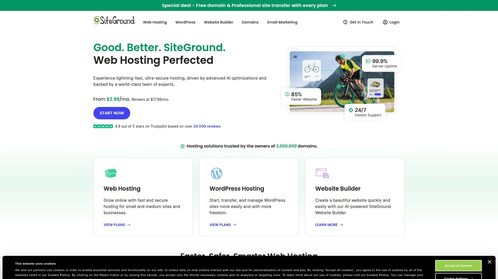

It offers managed WordPress hosting with features like automatic updates, enhanced security, and performance tools. One of its standout features is the Ultrafast PHP setup, which can significantly speed up your site. SiteGround's plans also include auto-scaling, which helps handle unexpected traffic spikes without a hitch, and developer-friendly tools like Git integration and staging environments.

## **[InMotion Hosting](https://www.inmotionhosting.com)**

InMotion Hosting is a well-established provider with a strong reputation for performance, making it a dependable choice for mid-sized businesses and professional blogs.

They offer a rare 99.99% uptime guarantee and a generous 90-day money-back window. InMotion provides a wide array of hosting solutions, including shared, WordPress, VPS, and dedicated servers. Their U.S.-based support team is well-regarded, and they provide a streamlined onboarding process for new customers.

## **[Cloudways](https://www.cloudways.com)**

Cloudways offers a unique and flexible approach to managed hosting, allowing you to host your site on top-tier cloud providers like DigitalOcean, AWS, and Google Cloud without needing sysadmin skills.

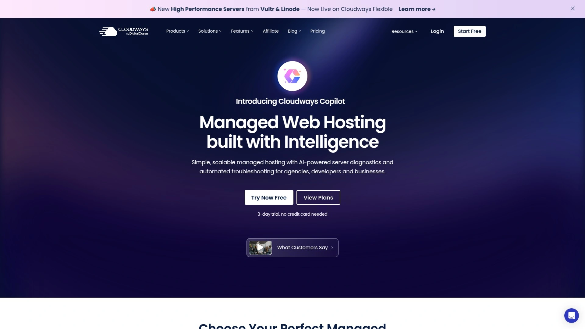

This platform is ideal for developers and agencies who want performance and scalability with pay-as-you-go pricing. It includes built-in advanced caching, staging environments, monitoring, and team collaboration tools. While it's a managed platform, you still get SSH access and control over your server environment.

## **[DreamHost](https://www.dreamhost.com)**

DreamHost provides excellent value and is highly recommended for beginners, thanks to its user-friendly interface and affordable plans.

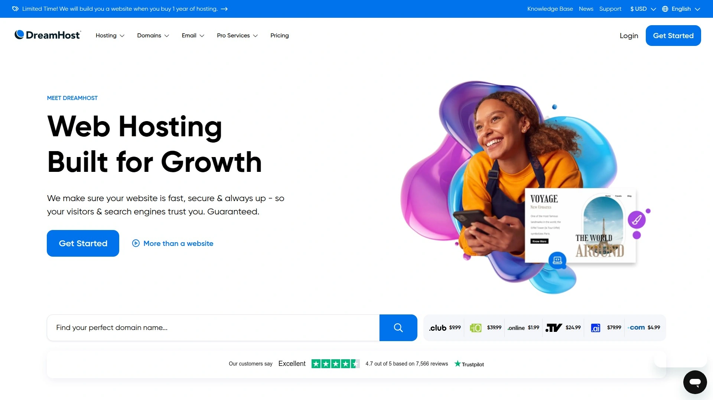

It is one of the few hosting providers officially recommended by WordPress.org. All plans come with unmetered bandwidth and SSD storage for fast performance. DreamHost also offers an industry-leading 97-day money-back guarantee, giving you ample time to test their services risk-free.

## **[Bluehost](https://www.bluehost.com)**

Bluehost is one of the most popular web hosts, especially for beginners launching their first WordPress site.

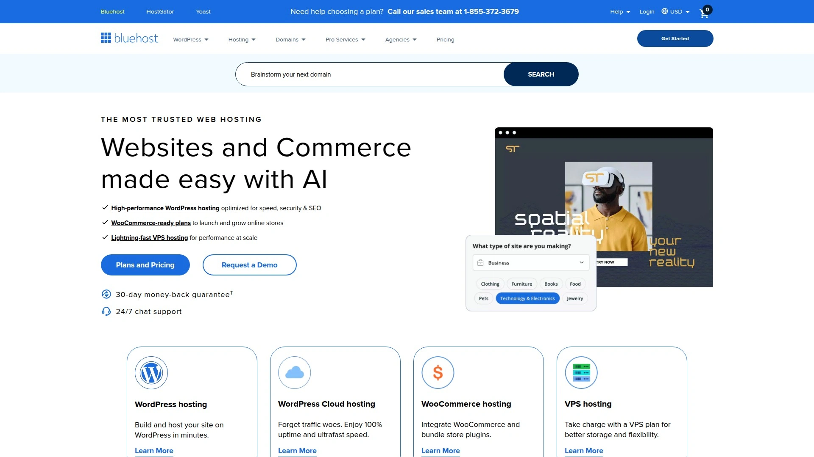

It's known for its easy one-click WordPress installation and a straightforward user dashboard. Bluehost offers a free domain name for the first year, free SSL, and a solid set of features to get a new website off the ground quickly. Their services are designed to be user-friendly, reducing the technical friction for new site owners.

## **[A2 Hosting](https://www.a2hosting.com)**

A2 Hosting emphasizes speed with its "Turbo Servers," which promise up to 20x faster page loads.

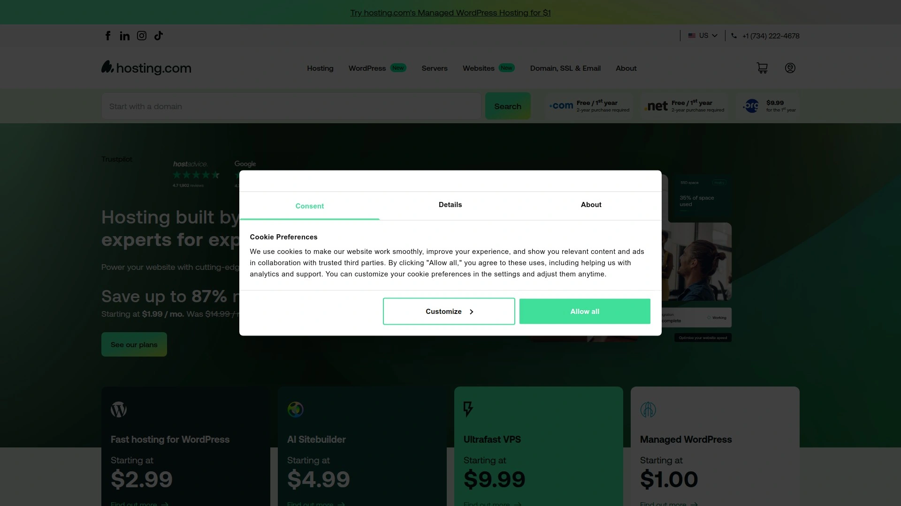

They offer a range of hosting options from shared to dedicated, with both managed and unmanaged VPS plans available. This makes A2 a good middle-ground for those who want high performance without the premium price tag of some competitors. Free site migrations and staging environments are included in many of their plans.

## **[Kinsta](https://kinsta.com)**

Kinsta is a premium managed WordPress hosting provider built on the Google Cloud Platform, designed for users who need exceptional speed, security, and scalability.

It uses a container-based technology, ensuring that your site's resources are isolated and performance is consistent. Kinsta is a great choice for developers and high-traffic sites, offering advanced features and top-tier support. However, this premium service comes at a higher price point.

## **[WPX Hosting](https://wpx.net)**

WPX is a managed WordPress host that focuses on delivering top-tier speed and exceptional customer support, with an average live chat response time of around 30 seconds.

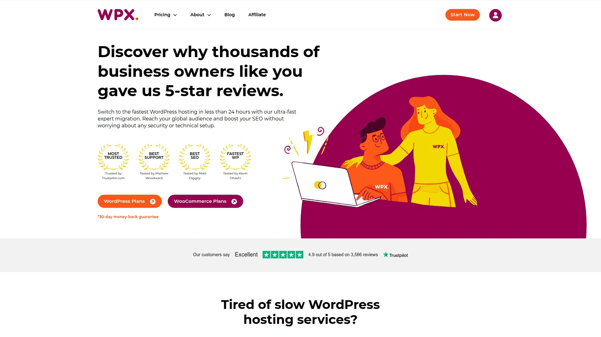

They offer their own high-speed custom Content Delivery Network (CDN), unlimited site migrations, and free malware removal. WPX is particularly well-suited for affiliate marketers and bloggers whose revenue depends on site performance and uptime.

## **[ScalaHosting](https://www.scalahosting.com)**

ScalaHosting is a strong contender in the VPS space, offering both managed and self-managed plans with a focus on security and performance.

They developed their own proprietary control panel, SPanel, as an alternative to cPanel, which helps keep costs down. ScalaHosting provides daily remote backups, robust security tools, and is a reliable choice for businesses that have outgrown shared hosting.

## **[HostPapa](https://www.hostpapa.com)**

HostPapa stands out for its powerful server configurations and commitment to customer service, using modern AMD and Intel hardware for high performance.

They offer a streamlined server setup and free migration to help new customers transition smoothly. With a high support satisfaction rate and a 30-day satisfaction guarantee, HostPapa positions itself as a trusted partner for businesses needing robust dedicated or VPS solutions.

## **[InterServer](https://www.interserver.net)**

InterServer is a go-to provider for users who value customization and affordability in a dedicated server.

By managing their own data centers, they offer a high degree of flexibility and hands-on support. A key feature is their "price-lock guarantee," ensuring the price you sign up for is what you'll pay for the life of the account. They also offer a wide selection of operating systems and control panels.

## **[IONOS](https://www.ionos.com)**

IONOS offers some of the most affordable entry-level VPS hosting plans on the market, starting at just a few dollars per month.

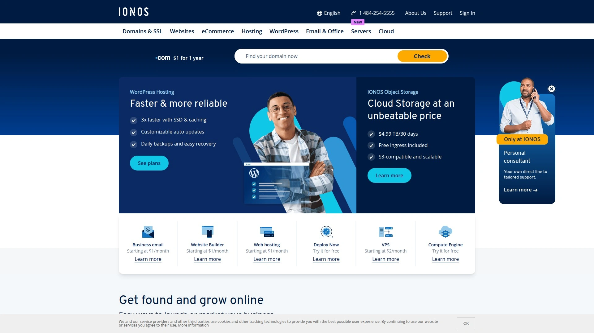

These plans are great for developers and hobbyists on a tight budget who still need reliable performance. Plans come with unlimited traffic, fast NVMe storage, and a 99.99% uptime promise. It's a solid, no-frills option for getting a server up and running quickly.

## **[Namecheap](https://www.namecheap.com)**

Primarily known as a domain registrar, Namecheap also offers surprisingly affordable and reliable hosting services.

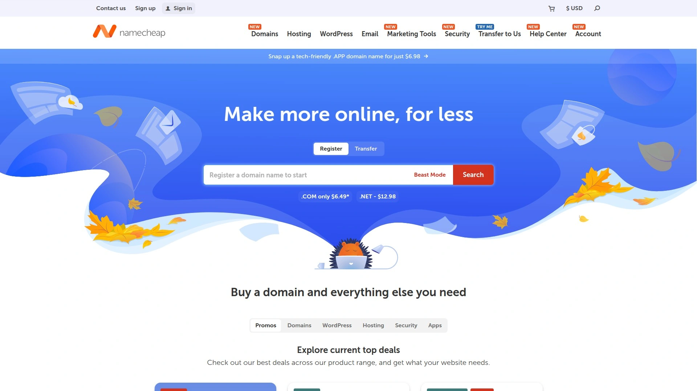

They are a great option for those looking for budget-friendly dedicated servers without sacrificing core features. While not as feature-rich as premium providers, Namecheap delivers solid performance for the price, making it a viable choice for startups and smaller projects.

## **[HostGator](https://www.hostgator.com)**

HostGator is a well-known name in the hosting industry, offering a wide range of services with proven support and scalability.

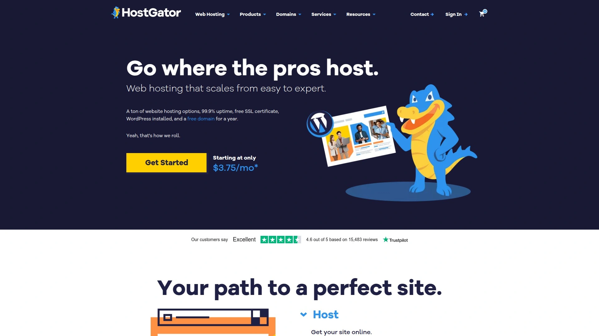

They provide shared, VPS, and dedicated hosting solutions suitable for everything from personal blogs to large corporate websites. HostGator is often praised for its flexibility and user-friendly tools, making it accessible to both beginners and experienced users.

## **[Hetzner](https://www.hetzner.com)**

Hetzner is a German hosting company popular among developers and system administrators for its high-performance, low-cost dedicated and cloud servers.

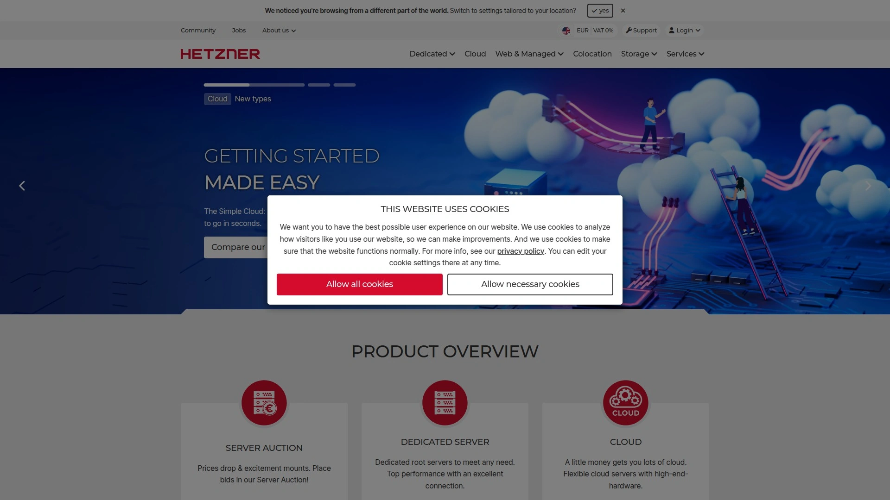

If you are comfortable managing your own server, Hetzner offers some of the best hardware for the money. They are a favorite in the self-hosting community for their powerful machines and reliable network, though their support is geared towards technically proficient users.

## **[Kamatera](https://www.kamatera.com)**

Kamatera is a global cloud services platform that offers highly flexible and scalable VPS hosting.

They allow you to custom-build your server, choosing the exact amount of CPU, RAM, and storage you need, and you only pay for what you use. With data centers around the world, Kamatera is an excellent choice for businesses that need to deploy servers in specific geographic locations for low latency.

## **[Squarespace](https://www.squarespace.com)**

While primarily known as a website builder, Squarespace also provides managed cloud hosting as part of its all-in-one platform.

This is the perfect option for those who want a completely hands-off approach to hosting. You don't have to worry about server management, security, or updates. It's an ideal solution for design-focused businesses, creatives, and anyone who prioritizes ease of use and beautiful templates over technical control.

# FAQ

**How do I choose between Shared, VPS, and Dedicated hosting?**
Shared hosting is ideal for beginners and small websites on a budget. VPS (Virtual Private Server) offers more power and control for growing sites with increasing traffic. A dedicated server gives you an entire physical server for maximum performance, security, and control, best suited for high-traffic websites and resource-intensive applications.

**What is more important for speed: server hardware or location?**
Both are critical. Fast hardware like NVMe SSDs provides the raw processing power for quick data retrieval. A server location close to your primary audience reduces latency, ensuring that speed is delivered to your visitors with minimal delay. A good host optimizes both.

# Conclusion

Choosing the right web host is fundamental to your online success, impacting everything from user experience to search engine rankings. This list provides a starting point, but the best choice ultimately depends on your specific needs, budget, and technical comfort level. For those seeking a strong all-around platform with a wide range of scalable options and a solid focus on modern performance features, [Ultahost](https://ultahost.com) stands out as an excellent choice for many use cases.
